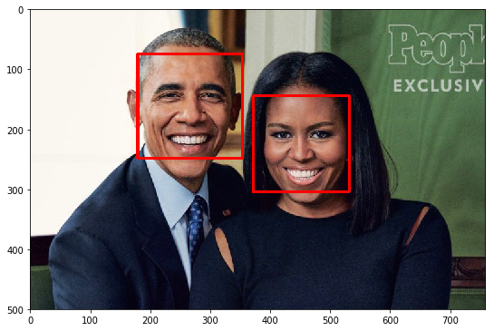
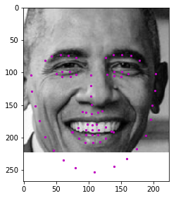
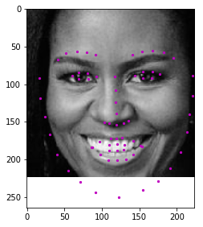
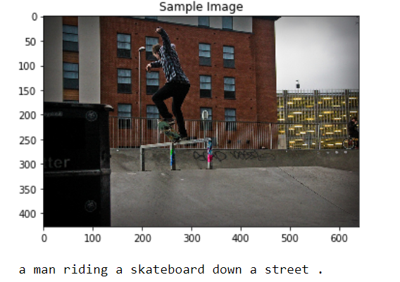
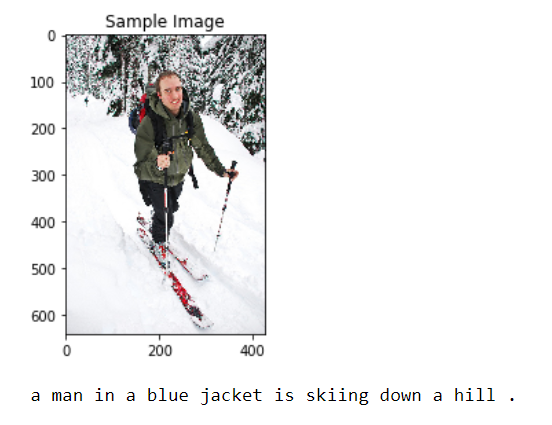
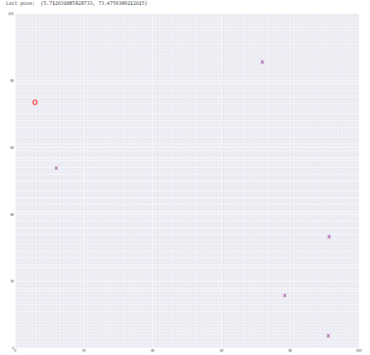

# Computer Vision Nanodegree Projects
 
## Overview 
This repository is a collection of projects I completed for the [Udacity Computer Vision Nanodegree](https://www.udacity.com/course/computer-vision-nanodegree--nd891), which I implemented with various computer vision tools from PyTorch to OpenCV. 

## Content 
1. [Project 1](P1/P1-Facial%20Keypoint%20Detection): Facial Keypoint Detection
2. [Project 2](P2-Image%20Captioning): Image Captioning 
3. [Project 3](P3-Landmark%20Detection%20&%20Tracking%20(SLAM)): Landmark Detection (SLAM)

## Projects 

### **Project 1: Facial Keypoint Detection**
For this project, I built a facial keypoint detection system using Haar Casacdes and Convolutional Neural Network (CNN). This facial keypoint detection system that takes in any image with faces, and predicts the location of 68 distinguishing keypoints on each face!

**Demo**: results produced by my model  

 

### **Project 2: Image Captioning**
For this project, I designed and created a Convolutional Neural Network (CNN), Recurrent Neural Network (RNN) and LSTM (Long Short Term Memory) architecture to automatically generate captions from images. The model is trained on Microsoft Common Objects in COntext ([MS COCO](https://cocodataset.org/#home)) dataset.

**Demo**: results produced by my model  

 

### **Project 3: Landmark Detection (SLAM)**

For this project, I implemented SLAM (Simultaneous Localization and Mapping) for a 2 dimensional world by combining robot sensor measurements and movement to create a map of an environment.

**Demo**: results produced by my model  

